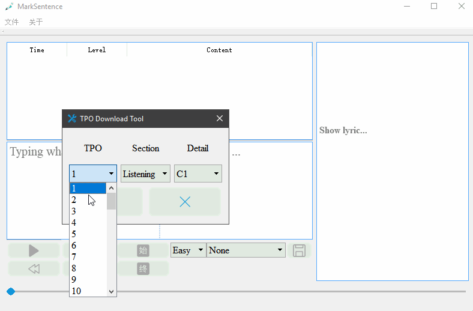
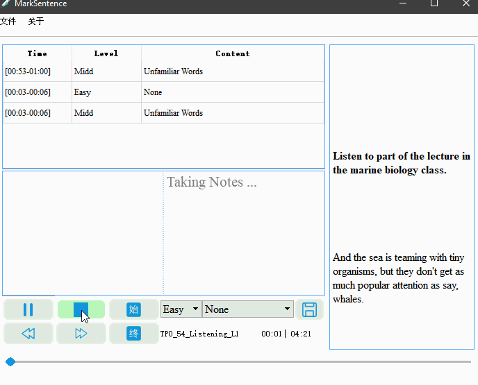
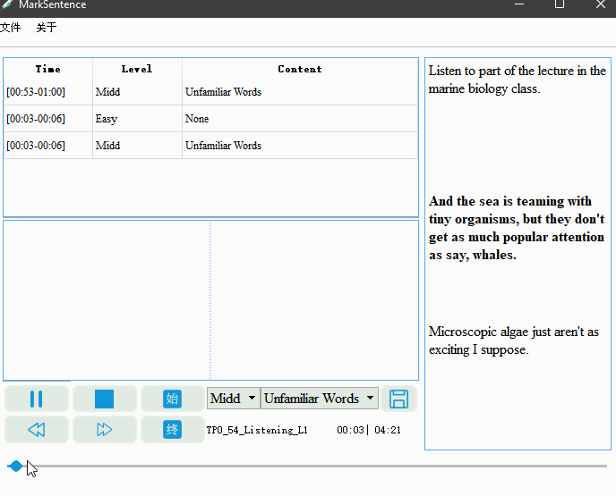

# MarkSentence 
一个在可以文本对照的听力句子的标记工具，即精听工具，目前专门针对于`TOEFL`

- 可以下载`TPO1-54`的所有听力(包括**口语**和**写作**部分)
- 对音频截断, 并且做上标记, 生成标签
- 所做的标签会被保存, 在下次打开音频的时候会载入

## Getting Started 
- Windows
	- [MarkSentenceV0.9.4](https://github.com/Gltina/marksencent/releases/download/V0.9.4/marksentenceV0.9.4.zip)
	- [(阿里服务器)MarkSentenceV0.9.4.zip](http://39.97.115.128:8000/SHATOEFL/marksentenceV0.9.4.zip)
- 解压`zip`文件，运行`marksentence.exe`即可

## Compiling from source

### Prerequisites

- Visual Studio 2015
- Qt 5.9.0 with MSVC2015

###  Dir Content  
这些是程序运行的时自动生成的目录:

- `Json/*.json`:保存你的标签内容
- `Log/log`:操作日志
- `Lyric/*.txt`:与`TPO`音频对应的"歌词"文件
- `TPO/TPO[1-54]/*.mp3`:下载的`TPO`音频文件

展开的结构如下：

```
├─Json
│      TPO_4_Listening_C1.json
│      TPO_54_Listening_L1.json
│
├─Log
│      log
│
├─Lyric
│      TPO04C1.txt
│      TPO54L1.txt
│      ...
│
└─TPO
    ├─TPO4
    │      TPO_4_Listening_C1.mp3
    │
    ├─TPO54
    │      TPO_54_Listening_L1.mp3
   	│
    └─ ...
		   ...
```

## Usage
- 快捷键
	- 播放与暂停：`F1`
	- <sup>*</sup>后退与快进：`F2`, `F3` （默认是3s）
	- 保存当前标记： `Enter`
	- 断点的选定和取消：单击`始`以及`终`
> [*] 有`Lyric`则是下一句和上一句

- 使用示例
	- 
	- 
	- 
	- 


## Project status


更多请查看[项目日志](log/README.md) 

## Q&A
- 有些听力播放不了？:worried:
	- 可以尝试下载[LAVFilters](https://github.com/Nevcairiel/LAVFilters/releases/download/0.74.1/LAVFilters-0.74.1-Installer.exe)，再添加`LAV Filters\x86`至环境变量。我已意识到了这个问题:smirk:，会在程序中添加相关的`dll`的，如果你还是遇到了这个问题，请联系我:fries:
- 不能播放自己的音频？
	- 是的，所以这里推荐使用下载音频文件。（其实用自己的也不是不可以，只是你需要更改文件名，修改的规则有点麻烦）
- 界面这么丑，你蒸菜！！！！
	- 做一个好看的`UI`真的不容易呢:stuck_out_tongue:

## Contribute
如果想了解项目中的小细节，可以查看[sparkSpot](./log/sparkSpot.md)

关于英语精听有什么方法，如何有计划的复习英语的听力... 所有的这些问题欢迎讨论

## Support
ptsph\*foxmail.com(*->@) 

## Thanks 
[iconfont](https://www.iconfont.cn/home/index)

## License
[GNU GPL3.0](https://github.com/Gltina/MarkSencent/blob/master/LICENSE)